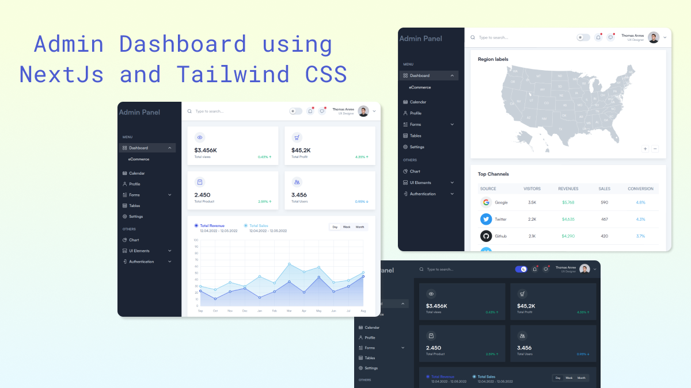

# Next.js - Admin Dashboard

Admin dashboard template is a free and open-source built on **Next.js and Tailwind CSS** providing developers with everything they need to create a feature-rich and data-driven: back-end, dashboard, or admin panel solution for any sort of web project.



You get access to all the necessary dashboard UI components, elements, and pages required to build a high-quality and complete dashboard or admin panel. Whether you're building a dashboard or admin panel for a complex web application or a simple website. 

The dashboard utilizes the powerful features of **Next.js 14** and common features of Next.js such as server-side rendering (SSR), static site generation (SSG), and seamless API route integration. Combined with the advancements of **React 18** and the robustness of **TypeScript**.

### [✨ Visit Demo](https://tailadmin.com/)


## Installation
Here are the steps you need to follow to install the dependencies.

1. Clone or Download and extract the template from Next.js Templates.

2. After that **cd** into the template directory then run this command to install all the dependencies

```
npm install
```
or

```
yarn install
```

3. Now run this command to start the developement server

```
npm run dev
```

or 

```
yarn dev
```
